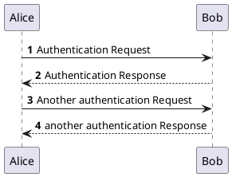

# Docsify个性化

docsify有不少有趣的插件，根据官方文档给出的插件列表，整理了一下有用或者有趣的插件，如果是官网插件列表里有详细描述的就不细说了，只放我的配置文件，如果是官网没有细说的，我就展示一下

插件列表：https://docsify.js.org/#/awesome?id=plugins

## 实时预览

根目录下打开命令行，执行`docsify serve docs`后便可以访问`http://localhost:3000`来实时预览docsify效果


## 全文搜索

[官网文档](https://docsify.js.org/#/zh-cn/plugins?id=%e5%85%a8%e6%96%87%e6%90%9c%e7%b4%a2-search)

配置文件：

```html
window.$docsify = {
	search: 'auto',
}
<script src="//polyfill.io/v3/polyfill.min.js?features=String.prototype.normalize"></script>
```


## 代码块复制

[官网文档](https://docsify.js.org/#/zh-cn/plugins?id=%e5%a4%8d%e5%88%b6%e5%88%b0%e5%89%aa%e8%b4%b4%e6%9d%bf)

配置文件：

```html
window.$docsify = {
  copyCode: {
    buttonText : 'Copy to clipboard',	// 展示的文字（右上角）
    errorText  : 'Error',				// 复制失败提示
    successText: 'Copied'				// 复制成功提示
  }
}
<script src="//cdn.jsdelivr.net/npm/docsify-copy-code/dist/docsify-copy-code.min.js"></script>
```


## 分页

项目地址：https://github.com/imyelo/docsify-pagination#readme

配置文件：

```html
window.$docsify = {
    pagination: {
        previousText: 'Previous',	// 前一页文本
        nextText: 'Next',			// 后一页文本
        crossChapter: true,			// 允许翻页
        crossChapterText: true,		// 展示前一页/后一页标题
    },
}
<script src="//cdn.jsdelivr.net/npm/docsify-pagination/dist/docsify-pagination.min.js"></script>
```

效果：


## 字数统计

项目地址：https://github.com/827652549/docsify-count

配置文件：

参数意义项目地址里均有说明

```html
window.$docsify = {
  count:{
    countable: true,
    position: 'top',
    margin: '10px',
    float: 'right',
    fontsize:'1.5em',
    color:'rgb(90,90,90)',
    language:'english',
    localization: {
      words: "",
      minute: ""
    },
    isExpected: true
  }
}
<script src="https://cdn.jsdelivr.net/npm/docsify-count@latest/dist/countable.min.js"></script>
```


## 选项卡

项目地址：https://jhildenbiddle.github.io/docsify-tabs/#/

配置文件:

```html
window.$docsify = {
  // ...
  tabs: {
    persist    : true,      // 刷新页面后是否保存当前选中的选项卡状态
    sync       : true,      // 相同标签之间的同步
    theme      : 'classic', // 主题三选一 'classic', 'material', false
    tabComments: true,      // tabs标签里嵌套tab标签
    tabHeadings: true       // 其实就是支持选项卡标题样式用md语法修改的意思
  }
};
<script src="https://cdn.jsdelivr.net/npm/docsify-tabs@1"></script>
....
</body>
</html>
<!-- 下面这个加在配置文件最后面就好了，是用来定义角标的样式的 -->
<style>
  .tab-badge {
    position: absolute;
    top: 0;
    right: 0;
    transform: translate(35%, -45%);	// 上面三行都是用于调整角标位置
    padding: 0.25em 0.35em;				// 角标高和宽
    border-radius: 10px;				// 圆角程度
    background: red;					// 角标背景色
    color: white;						// 角标字体颜色
    font-family: sans-serif;			// 角标字体
    font-size: 11px;					// 角标字体大小
    font-weight: bold;					// 角标字体加粗
  }
</style>
```

参数解释详情查看官网：https://jhildenbiddle.github.io/docsify-tabs/#/?id=options

同步选项效果：

<!-- tabs:start -->

#**同步1**

点一下同步2试试

#**同步2**

看到下面的标签也同步了有木有

#**同步3**

标签名不一样就不会同步了

<!-- tabs:end -->

<!-- tabs:start -->

#**同步1**

这里也可以点一下同步2试试

#**同步2**

都一样的

#**不同步3**

标签名不一样就不会同步了

<!-- tabs:end -->

<details>
    <summary>点击展开代码</summary>


```html
<!-- tabs:start -->

#**同步1**

点一下同步2试试

#**同步2**

看到下面的标签也同步了有木有

#**同步3**

标签名不一样就不会同步了

<!-- tabs:end -->

<!-- tabs:start -->

#**同步1**

这里也可以点一下同步2试试

#**同步2**

都一样的

#**不同步3**

标签名不一样就不会同步了

<!-- tabs:end -->
```


</details>

效果：

<!-- tabs:start -->

####**正常**

正常展示

####**<em>斜体</em>**

标题也可以斜体

####****加粗****

还可以加粗

####**<span style="color: red;">变色</span>**

甚至可以换色

####**Tab5 <span class='tab-badge'>角标</span>**

还有个角标，但好像后面还有选项卡时就不好看

####**嵌套**

111

<!-- tabs:start -->

####**真**

好难看

####**不**

真的离谱

####**错**

还是算了吧

<!-- tabs:end -->

####**嵌套2**

嵌套的标签后面必须再有一个选项卡，不然会展示不出来嵌套效果，应该是标签被提前闭合的原因

<!-- tabs:end -->

<details>
    <summary>点击展开代码</summary>


```html
<!-- tabs:start -->

####**正常**

正常展示

####**<em>斜体</em>**

标题也可以斜体

####****加粗****

还可以加粗

####**<span style="color: red;">变色</span>**

甚至可以换色

####**Tab5 <span class='tab-badge'>角标</span>**

还有个角标，但好像后面还有选项卡时就不好看

####**嵌套**

111

<!-- tabs:start -->

####**真**

好难看

####**不**

真的离谱

####**错**

还是算了吧

<!-- tabs:end -->

####**嵌套2**

嵌套的标签后面必须再有一个选项卡，不如会展示不出来嵌套效果，应该是标签被提前闭合的原因

<!-- tabs:end -->
```


</details>


## LaTex公式渲染

项目地址：https://github.com/upupming/docsify-katex

项目文档：https://upupming.site/docsify-katex/docs/#/

配置文件：

```
<script src="//cdn.jsdelivr.net/npm/docsify-katex@latest/dist/docsify-katex.js"></script>
<link rel="stylesheet" href="//cdn.jsdelivr.net/npm/katex@latest/dist/katex.min.css"/>
```

效果：

$\def\bar#1{#1^2} \bar{y}$ ==> `$\def\bar#1{#1^2} \bar{y}$`

$\tilde{a}$  ==> `$\tilde{a}$`

$\begin{matrix}a & b \\ c & d\end{matrix}$   ==> `$\begin{matrix}a & b \\ c & d\end{matrix}$`


## 自定义引用/提示/警告标签

项目地址：https://github.com/fzankl/docsify-plugin-flexible-alerts

配置文件：

```
'flexible-alerts': {
    note: {
        label: "Note"
    },
    tip: {
        label: "Tip"
    },
    warning: {
        label: "Warning"
    },
    attention: {
        label: "Attention"
    },
    comment: {
        label: 'Comment',
        className: 'note'
    }
},

<script src="https://unpkg.com/docsify-plugin-flexible-alerts"></script>
```

效果：


> [!note]
>
> 注意

- 配置文件的label是什么，左上角的标签就是什么

> [!attention]
>
> 注意（比note更重要）

- 还有一个点，如果连续使用多个标签，中间不使用无序列表`-`隔开会导致上面的标签和文字全部被吃掉，不知道为什么，应该属于插件的bug

> [!tip]
> 提示

- 该插件总共支持4种默认样式

> [!warning]
>
> 警告，这是最后一种

- 除此之外还可以自定义样式

> [!tip|style:flat|label:自定义标签|labelVisibility:hidden]
>
> 使用方式也很简单，比如这个
>
> `> [!tip|style:flat|label:自定义标签|labelVisibility:hidden]`

参数列表：

| key             | value                                 | 描述                                      |
| --------------- | ------------------------------------- | ----------------------------------------- |
| [!type]         | note, tip, warning, attention四选一   | 标签类型                                  |
| style           | callout, flat二选一                   | 标签块样式                                |
| icon            | 图标名 eg. fas fa-comment             | 左上角的图标                              |
| className       | 自带note, tip, warning, attention四个 | 可以自定义css的，不然就是docsify自带的4个 |
| labelVisibility | visible(默认), hidden 二选一          | 标签名是否可见                            |
| iconVisibility  | visible(默认), hidden 二选一          | 图标是否可见                              |

参数列表是用来配置自定义标签的，除了在页面内填写参数，还可以直接使用配置文件配置

配置文件：

```
'flexible-alerts': {
    note: {
        label: "Note"
    },
    tip: {
        label: "Tip"
    },
    warning: {
        label: "Warning"
    },
    attention: {
        label: "Attention"
    },
    引用名: {
        label: '标签名',
        className: '样式',
        icon: '图标'
    }
},
```

eg.

```
comment: {
    label: 'Comment',
    className: 'note'
}
```

该配置文件表示标签名为`Comment`，使用的是`note`标签的样式

效果：

> [!Comment|style:flat|icon:iconfont icon-comment]
>
> `> [!Comment|style:flat|icon:iconfont icon-comment]`阿里的图标用`iconfont icon-xxx`，Font Awesome的图标用`fas fa-xxx`

此处的icon需要自己引入，一般使用的是[阿里云的图标库](https://www.iconfont.cn)或[Font Awesome库](http://www.fontawesome.com.cn/)，使用时需在根目录`index.html`引入css文件（需要先下载对应的css文件到本地，然后再引入本地路径的css）

```html
<link rel="stylesheet" href="_icon/font-awesome/css/font-awesome.css">
<link rel="stylesheet" href="_icon/iconfont/iconfont.css">
<!-- Font Awesome也可以用在线的，引入下面这个 -->
<!-- <link href="http://netdna.bootstrapcdn.com/font-awesome/4.7.0/css/font-awesome.min.css" rel="stylesheet"> -->
```

使用时只需要填写icon的参数即可，但是这里我发现Fone Awesome的图标渲染不出来，不知道为什么....阿里的图标渲染出来位置又很奇怪...懂前端的可能还是自己写个css好点

> [!comment|style:callout|icon:fas fa-comment]
>
> `[!comment|style:callout|icon:fas fa-comment]`这个就渲染不出，没太懂

还有另外两个好玩的

`?>`和`!>`可以分别渲染为以下两种引用样式

?> 比如这个

!> 或者这个

## 左右分栏

项目地址：https://github.com/VagnerDomingues/docsify-example-panels

项目文档：https://vagnerdomingues.github.io/docsify-example-panels/#/

效果：

<!-- panels:start -->
<!-- div:title-panel -->

  **<big>这里是分栏的标题</big>**

<!-- div:left-panel -->

  这边一般用来解释右边是什么，分栏的左右比例可以在`index.html`里设置，在最下面的`style`标签内设置，比如我就设置左70%，右30%

```html
<style>
  :root {
    --docsify-example-panels-document-width: 100%; /* Remove margins */
    --docsify-example-panels-left-panel-width : 70%; /* bit more for left */
    --docsify-example-panels-right-panel-width : 30%; /* bit less for right */
  }
</style>
```


<!-- div:right-panel -->

这边可以放代码

```markdown
但是很奇怪，像项目文档里面可以直接把分栏代码块放进来
但是我放进来就会被识别为分栏代码块的一部分
而不是单纯的代码
```

<!-- panels:end -->

## 图标引入

项目地址：https://github.com/erickjx/docsify-fontawesome

配置文件：

```
<link rel="stylesheet" href="unpkg.com/@fortawesome/fontawesome-free/css/fontawesome.css" />
<link rel="stylesheet" href="unpkg.com/@fortawesome/fontawesome-free/css/brands.css" />
<link rel="stylesheet" href="unpkg.com/@fortawesome/fontawesome-free/css/regular.css" />
<link rel="stylesheet" href="unpkg.com/@fortawesome/fontawesome-free/css/solid.css" />

<script src="//unpkg.com/docsify-fontawesome/dist/docsify-fontawesome.min.js"></script>
```

使用方法：

```
:fas fa-xxx:
# 两个都可以
<i class="fas fa-xxx"></i>
```

但是和自定义标签一样，font awesome渲染不出来，不知道为什么


## 流程图

项目地址：https://github.com/imyelo/docsify-plantuml

配置文件：

```
<script>
window.$docsify = {
  plantuml: {
    skin: 'default',
  },
}
</script>

<script src="//unpkg.com/docsify-plantuml/dist/docsify-plantuml.min.js"></script>
```

效果1：

```plantuml
:一级: -right-*  :二级: 
```

md：

````
```plantuml
:一级: -right-*  :二级: 
```
````

效果2：



md：

````

````


## 右侧导航栏

就是按目录跳转的意思，挺不错的，可以省去头部自定义目录，又可以不用在左侧导航栏搞的很臃肿

项目地址：https://github.com/mrpotatoes/docsify-toc

配置文件：

```
window.$docsify = {
  toc: {
    scope: '.markdown-section',
    headings: 'h1, h2, h3, h4, h5, h6',
    title: '目录',
  },
}
<link rel="stylesheet" href="https://unpkg.com/docsify-toc@1.0.0/dist/toc.css">
<script src="https://unpkg.com/docsify-toc@1.0.0/dist/toc.js"></script>
```

title为目录标题，headings表示要放进目录的标题级别，因为我习惯只有文档名用一级标题，剩下的都是二级以后的标题，所以我这里直接从h2开始

不过我后来发现当目录太长时，右侧导航栏没办法滚动，导致目录下面的标题无法展示，这是一个小bug，估计作者也没想到有人目录那么长，解决方法可以减少展示的标题数，比如只展示2，3级标题

## 页脚设置

页面右下角的页脚

项目地址：https://github.com/erickjx/docsify-footer-enh

配置文件：

```
<script>
  window.$docsify = {
    footer: {
      copy: '<span>无名大仙 &copy; 2022</span>',
      auth: '<a href="https://vvmdx.github.io">by vvmdx</a>',
      pre: '<hr/>',
      style: 'text-align: right;',
      class: 'className',
    },
  };
</script>
<script src="//unpkg.com/docsify-footer-enh/dist/docsify-footer-enh.min.js"></script>
```

本质上是html标签，因此可以自己搞个链接进去

## 夜间模式

项目地址：https://github.com/Plugin-contrib/docsify-plugin/tree/master/packages/docsify-dark-mode

使用后会在页面右上角增加一个按钮，点击一下即可变为夜间模式，但是我用后发现按钮没提供api自定义位置和大小，要改的话只能自己改css文件，而且themecolor需要手动设置，不如按钮会显示不出来，还有就是只能给正文做夜间模式，左侧栏的目录没有夜间（这几个和官方文档说的都不一样，这个可以自己试一下，我试了感觉不好用）


## 顶部通知

项目地址：https://github.com/Plugin-contrib/docsify-plugin/tree/master/packages/docsify-top-banner-plugin

看项目地址即可，很详细，使用后会在顶部出现一行通知栏，但是我觉得不好看


## 下拉框

> 这和做选项卡的貌似是同个团队

项目地址：https://github.com/jthegedus/docsify-select

项目文档：https://jthegedus.github.io/docsify-select/#/

配置文件：

```
window.$docsify = {
  // ...
  select: {
    detectOperatingSystem: {
      enabled: false,
      menuId: "operating-system"
    },
    sync: false,
    theme: "classic"
  }
};

<script src="https://cdn.jsdelivr.net/npm/docsify-select@1"></script>
```

效果：

<!-- select:start -->
<!-- select-menu-labels: 第一个下拉框, 第二个下拉框 -->

你以为这很高级

#### --1,1--

1+1=2

#### --1,2--

1+2=3

#### --2,1--

2+1=3

#### --2,2--

2+2=4

<!-- select:end -->

实际上都是提前写好的...

md源码：

```
<!-- select:start -->
<!-- select-menu-labels: 第一个下拉框, 第二个下拉框 -->
你以为这很高级
#### --1,1--
1+1=2
#### --1,2--
1+2=3
#### --2,1--
2+1=3
#### --2,2--
2+2=4
<!-- select:end -->
```

## 封面右上角图标

docsify本来就自带了封面右上角的github跳转，这个可以自定义一些有趣的icon，其他的也没什么

项目地址：https://github.com/Koooooo-7/docsify-corner

## 侧边栏页脚

项目地址：https://github.com/markbattistella/docsify-sidebarFooter

和前面的页脚设置差不了多少，这个的参数多一点，~~两个选一个用就行~~

这个东西好像怪怪的，用了后和侧边栏好像不太兼容，而且会导致前面的页脚设置失效，感觉不好用

## 侧边栏目录折叠

好用，强推！

项目地址：https://github.com/iPeng6/docsify-sidebar-collapse

配置文件：

```html
<script>
  window.$docsify = {
    loadSidebar: true,
    alias: {
      '/.*/_sidebar.md': '/_sidebar.md', // 侧边栏目录，有多深就写多深
    },
    subMaxLevel: 4, // 需要折叠的层数
    sidebarDisplayLevel: 2, // 展示的级别，这里是展示前两级目录
  }
</script>
<link rel="stylesheet" href="//cdn.jsdelivr.net/npm/docsify-sidebar-collapse/dist/sidebar.min.css" />
<!-- 上面是箭头状的，下面是目录样式的，个人感觉下面的不好看，和主题不符且不够简洁 -->
<!-- <link rel="stylesheet" href="//cdn.jsdelivr.net/npm/docsify-sidebar-collapse/dist/sidebar-folder.min.css" /> -->
<script src="//cdn.jsdelivr.net/npm/docsify-sidebar-collapse/dist/docsify-sidebar-collapse.min.js"></script>
```

## 内部链接

项目地址：https://github.com/zpengg/docsify-wikilink

项目文档：https://zpengg.github.io/docsify-wikilink/#/

配置文件：`<script src="https://cdn.jsdelivr.net/npm/docsify-wikilink@1"></script>`

用来链接到同个目录下的其他文件

使用：

[[TestFile#topic 2|测试文档]]

```
[[TestFile#topic 2|测试文档]]或定位到别的目录[[subPath/subPathFile]]
```

应该主要是用于链接到没写在侧边栏的文档，不过测试发现可能导致侧边栏混乱，感觉会牵一发动全身

而且子目录那个有个缺点，就是他只能链接到当前目录的子目录，不能跨同级目录，感觉稍微鸡肋

## 还是页脚

这个的优点在于自由度高，可用markdown语法

项目地址：https://github.com/alertbox/docsify-footer

项目文档：https://alertbox.github.io/docsify-footer/#/

配置文件：

```
window.$docsify = {
  loadFooter: true,
  // 上面默认从_footer.md获取页脚，下面可以自定义页脚文件位置，二选一即可
  loadFooter: '_footer.md',
};

<script src="//cdn.jsdelivr.net/npm/@alertbox/docsify-footer/dist/docsify-footer.min.js"></script>
```

然后在\_footer.md里编辑页脚信息即可


## 行内代码语法高亮？

项目文档：https://www.npmjs.com/package/@rakutentech/docsify-code-inline

配置文件：`<script src="//unpkg.com/@rakutentech/docsify-code-inline/dist/index.min.js"></script>`

md源码：

````
`[`<link href="foo">` html]`
```
[`System.output.println("This is Java");` java]
```
[`echo "This is PHP";` php]
````

效果：

`[`<link href="foo">` html]`

```
[`System.output.println("This is Java");` java]
```

[`echo "This is PHP";` php]

有一说一没太懂这个插件应该用在什么场景，按理来说好像是支持多语言的？不太懂

## 备案

现在的域名都必须要有备案了，如果使用国内服务器的话，因此这个也是必须要的了

项目地址：https://github.com/HerbertHe/docsify-beian

配置文件：

```
window.$docsify = {
  beian: {
        ICP: "",
        NISMSP: {
            number: "",
            url: "",
            id: ""
        },
    },
}
<script src="https://cdn.jsdelivr.net/npm/docsify-beian@latest/dist/beian.min.js"></script>
```

| 属性名称        | 属性解释                                                     | 默认值 |
| --------------- | ------------------------------------------------------------ | ------ |
| `ICP`           | 工信部ICP备案号                                              | ""     |
| `NISMSP`        | 全国互联网安全管理服务平台备案（公安部备案）                 | {}     |
| `NISMSP.number` | 公安部备案号（没有留空）                                     | ""     |
| `NISMSP.url`    | 公安部备案链接（没有留空）                                   | ""     |
| `NISMSP.id`     | 公安部备案号的数字部分（没有留空，优先级比`NISMSP.url`更高，用于生成跳转链接） | ""     |

参数就不解释了，可以参照备案网下载的html代码来填写


## 阅读进度条

项目地址：https://github.com/HerbertHe/docsify-progress

配置文件：

```
window.$docsify = {
    progress: {
        position: "top",
        color: "var(--theme-color,	#FFA500)",
        height: "5px",
    }
}
<script src="https://cdn.jsdelivr.net/npm/docsify-progress@latest/dist/progress.min.js"></script>
```

| 参数     | 值          | 描述                     |
| -------- | ----------- | ------------------------ |
| position | top, bottom | 进度条位置（顶部或底部） |
| color    | 十六进制rgb | 进度条颜色               |
| height   | [number]px  | 进度条粗细               |

这个不知道在哪一步突然消失了...之前还用的好好的，网上看到有人说这个和字数统计不兼容，不过亲测删掉字数统计插件也还是恢复不出来...

## 全页分栏

项目地址：https://github.com/shawntabrizi/docsify-slides

项目文档：https://www.shawntabrizi.com/docsify-slides/#/

效果参考文档，其实就是把整页分左右了，和前面的[左右分栏](#左右分栏)一样，但是前面的左右分栏要比这个好用，这个会作用于整页，而且这个插件，他说和paganation（[分页](#分页)）一起用更好，但实际上我会出问题，一起用的时候，下面那条换页的会一直存在（按理说应该吸附在底部才对），所以个人觉得不好用

## 更新时间

使用后会在文章末尾加上文档更新的时间

项目地址：https://github.com/pfeak/docsify-updated

配置文件：

```markdown
timeUpdater: {
    text: "?> Last update:  {Docsify-updated}",
    formatUpdated: " {YYYY}/{MM}/{DD} {HH}:{mm}:{ss}",
},
```

!> `?> Last update:  {Docsify-updated}` 这里面的Docsify的D需要小写，我这里大写是因为即时放在代码块里，他也会被渲染为时间，`?>`使用的是自定义标签的样式格式

## 文件嵌入

项目地址：https://github.com/docsifyjs/docs-zh/blob/master/embed-files.md

不是一个插件来着，是docsify 4.6自带的功能，它会将嵌入文档的内容直接显示出来

**效果1**：插入一个txt文档

md代码：`[测试文档](../_media/test.txt ':include')`

[测试文档](../_media/test.txt ':include')

[源文档](http://vvmdx.cool/_media/test.txt)

**效果2**：插入一个md文档

md代码：`[测试文档](../_media/test.md ':include')`

[测试文档](../_media/test.md ':include')


## 折叠

和自己写的html折叠不一样，这个提供了一个插件，某些场景下可能好看一些

项目地址：https://github.com/isaozler/docsify-accordion

配置文件：

```
<link rel="stylesheet" href="//unpkg.com/docsify-accordion/src/style.css">
<script src="//unpkg.com/docsify-accordion/src/index.js"></script>
```

md源码：

```
+ 点击展开 + 
  balabala
+ 点击展开 +
  balabala
```


效果：

+ 点击展开 +

  记得格式是`+(空格)点击展开(空格)+`

+ 代码 +

  ```
  试试代码块
  应该也是可以折叠的
  感觉好像比自己写html标签好看
  确实好像还行
  ```
  
  

## 图片缩放

项目地址：https://github.com/francoischalifour/medium-zoom

配置文件：`<script src="//cdn.jsdelivr.net/npm/docsify/lib/plugins/zoom-image.min.js"></script>`

项目地址说复杂了，其实只要引入这个配置就好了

效果：


## 代码高亮

docsify内置了Prism，prism默认支持的基本都是前端语言，其他的语言需要自己另外引入配置文件

项目地址：https://github.com/PrismJS/prism

配置文件：

```
<script src="//cdn.jsdelivr.net/npm/prismjs@1/components/prism-php.min.js"></script>
<script src="//cdn.jsdelivr.net/npm/prismjs@1/components/prism-java.min.js"></script>
<script src="//cdn.jsdelivr.net/npm/prismjs@1/components/prism-python.min.js"></script>
<script src="//cdn.jsdelivr.net/npm/prismjs@1/components/prism-sql.min.js"></script>
<script src="//cdn.jsdelivr.net/npm/prismjs@1/components/prism-c.min.js"></script>
<script src="//cdn.jsdelivr.net/npm/prismjs@1/components/prism-cpp.min.js"></script>
<script src="//cdn.jsdelivr.net/npm/prismjs@1/components/prism-go.min.js"></script>
```

**JAVA**

```java
public class HelloWorld {
    public static void main(String[] args){
        System.out.println("Hello World!");
    }
}
```

**PHP**

```php
<?php
    echo "Hello World!";
?>
```

**Python**

```python
print("Hello World!")
```

**SQL**

```sql
select * from user where id=1;
```

**c**

```c
# include <stdio.h>

int main() {
  printf("Hello World");
}
```

**cpp**

```cpp
# include <iostream>
using namespace std;
 
int main() 
{
    cout << "Hello, World!" << endl;
    return 0;
}
```

**go**

```go
package main
import "fmt"
func main() {
    fmt.Println("Hello World!")
}
```

